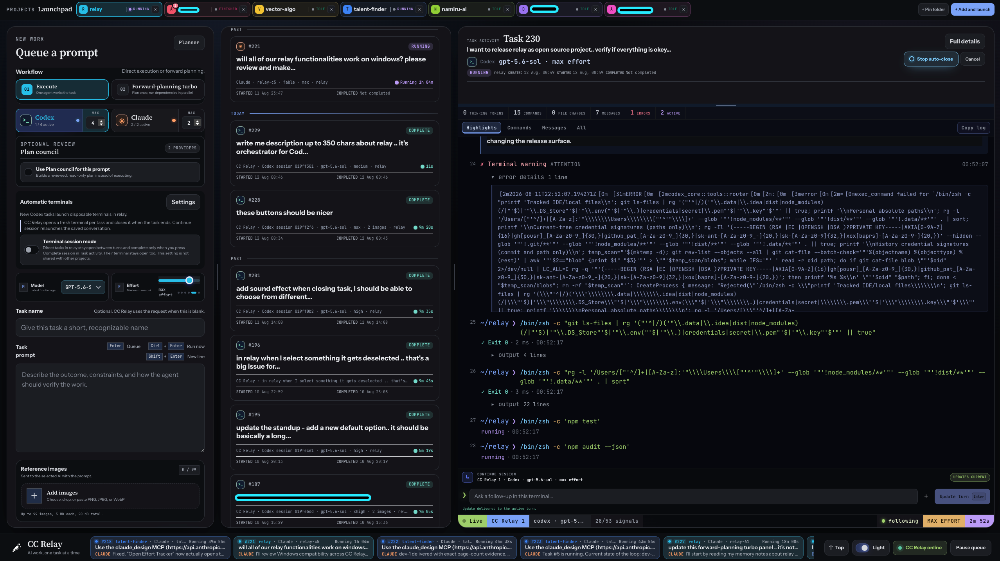

# CC Relay

> [!WARNING]
> **Tested only on macOS. Windows and Linux have not been tested yet.** Their code paths and Windows packages are experimental, so please report what you find.

[](https://github.com/Crowie-s-r-o/CC-Relay/actions/workflows/ci.yml)
[](https://github.com/Crowie-s-r-o/CC-Relay/releases/latest)
[](LICENSE)

### [Download the latest version](https://github.com/Crowie-s-r-o/CC-Relay/releases/latest)

**Stop babysitting AI terminals.** CC Relay is a local command center for Codex, Claude Code, and OpenCode. Queue work across projects, control concurrency, watch every task live, and let Codex and Claude challenge important plans. It uses your existing CLI authentication, not Relay-managed API keys.



## Why Relay

1. **Control provider concurrency.** Separate per-project limits for Codex, Claude, and OpenCode, with execution started only when a task has every slot it needs.
2. **Use disposable execution by default.** Codex and Claude receive owned terminals that launch minimized and close automatically. OpenCode runs as a bounded headless process with the same queue lifecycle.
3. **Run many projects from one Launchpad.** Repositories, queues, limits, history, and task state in one place.
4. **Queue the next prompts now.** Add, reorder, or edit queued work while tasks run; Relay dispatches on capacity.
5. **Make important plans survive a challenge.** Plan council has one provider author a plan and the other review it critically.
6. **Plan smart, execute economically.** Turbo gives every prompt a fresh high-effort planning session, then hands the complete graph to one fresh execution session that may coordinate internal sub-agents.
7. **Keep provider runway visible.** The compact status bar shows Claude's five-hour and weekly usage, distinct Fable weekly usage, and Codex five-hour and weekly usage, including the percentage used and provider-reported reset countdowns.

## Highlights

- **One global task monitor.** Follow running work and open terminal sessions across every project from compact status cards, without leaving the repository you are working in.
- **Terminal session workspaces.** Keep a direct task open across as many turns as needed, steer work while it runs, and finish it explicitly or by closing its terminal.
- **Plans, goals, and workers in one view.** Task Activity shows runtime, current plan steps, Codex goals, sub-agent assignments, commands, file changes, messages, errors, and results as they happen.
- **Live native token accounting.** The macOS Crowie title bar shows today's all-provider token total. Task Activity shows cumulative provider-reported input and output use, while it and the running-task monitor show average output tokens per attempt second throughout each run.
- **Searchable history and task-owned diffs.** Search task names, prompts, follow-ups, responses, results, and errors. Changes opens on exact patches reported by the task, with a separate Workspace window for every disk change observed while it ran.
- **A queue built for real work.** Star any task to keep it at the top, rename titles inline at any stage, reorder waiting work, use Run now for urgent dispatch, and continue completed conversations.
- **Reference images and local artifacts.** Attach screenshots and other visual context, then keep prompts, plans, events, results, errors, and attachments stored locally with the task.
- **Local push-to-talk prompting.** Hold a configurable key combination, speak, and release to insert a faster-whisper CPU transcription directly into the task prompt.
- **One-click saved skills.** Run the built-in Deploy check command with the selected provider, model, and effort without replacing the prompt already being written.
- **Completion you will not miss.** Choose a sound or spoken announcement, collect finished tasks in a durable Ready for review stack, and mark them reviewed individually or together.
- **AI changelogs on demand.** Standup turns completed execution attempts from a selected one-day or two-day range into concise Added, Changed, Fixed, and Security notes, then answers dated follow-up questions from the same saved evidence.
- **A desktop that adapts.** Move and resize the task monitor, switch themes, zoom the whole app, retain terminals when useful, and receive automatic updates on supported desktop installs.
- **Local by design.** Relay binds to loopback, keeps authentication inside the installed provider CLIs, and stores its task database and artifacts on your machine.

See the complete [feature inventory](FEATURES.md) for workflow details and operational behavior.

## Get started

Grab the packaged app from the [latest GitHub Release](https://github.com/Crowie-s-r-o/CC-Relay/releases/latest):

- **macOS (tested):** open the `.dmg` and drag **CC Relay** to **Applications**.
- **Windows (experimental):** run the `-Setup.exe` installer, or the `-Portable.exe` file to skip installing.

Signed macOS builds and installed Windows builds then check the same GitHub repository for releases every five minutes. Updates download in the background and install when you restart or normally quit CC Relay. The Windows portable build remains a manual download. The first macOS release that contains the automatic updater still needs the normal DMG installation once.

No source checkout or Node.js needed. Before queueing work, prepare at least one provider CLI: Codex with ChatGPT, Claude Code with a Claude subscription, or OpenCode with at least one configured model provider.

Voice input is optional. Turn it on in **Terminal settings**, select a working microphone, choose **Set up engine**, and keep Relay open while it creates a private Python runtime and downloads the multilingual faster-whisper base model. Setup requires Python 3.9 or newer and an internet connection. After setup, hold either displayed activation shortcut while speaking and release any one of its keys to stop and transcribe on the CPU. The primary default is `Ctrl+Shift+Space`, and an optional alternate shortcut is configurable. If a virtual or disconnected input records silence, Relay names that source instead of presenting a generic speech failure.

## The loop

Pin as many repositories as you want, pick a provider, model, effort, and workflow, then queue the prompt (`Ctrl+Enter` sends it to the front). Relay runs as many tasks in parallel as you allow; anything over the limit waits in the queue and launches the moment a slot frees up.

While work runs:

- **Every project at once.** Several repositories can execute side by side, each with its own queue, limits, and history.
- **Hear and see the finish.** A sound plays when a task ends, and completed tasks stack up as notifications you can click through and review one by one.
- **Use the original terminal inside Relay.** New Codex and Claude task terminals run in an embedded PTY with the CLI's own interface, direct typing, shortcuts, and resizing. **Window** expands the same terminal inside Relay. Each selected task starts on Original terminal; Relay activity and conversation filters remain explicit alternate views. Older external sessions have a labeled read-only screen, and headless runs report that no interactive terminal exists. See [embedded terminal behavior](wiki/embedded-original-terminal.md).
- **Fresh session per task.** Each execution starts a clean conversation, so context stays uncluttered and token use stays low. Relay saves the native conversation ID for continuation or retry where the provider supports it.

| Workflow | Best for |
| --- | --- |
| Execute | One focused Codex, Claude, or OpenCode task |
| Plan council | One provider writes the plan, the other tears it apart, the author revises |
| Forward-planning Turbo | A fresh planner builds the graph, then one fresh executor owns the complete implementation |
| Planner | Reusable project plans released through the normal queue |

## Safety

> [!CAUTION]
> CC Relay can start writable AI sessions with unattended permission settings. Use it only with repositories, prompts, hooks, and machines you trust.

It binds to `127.0.0.1`, keeps provider credentials inside their CLIs, stores task data locally, and closes only terminals it can prove it owns.

## Development

Running from source requires Node.js 24+ and at least one authenticated or configured provider CLI.

```bash
git clone https://github.com/Crowie-s-r-o/CC-Relay.git
cd CC-Relay
npm ci
npm start
```

Open [http://127.0.0.1:4768](http://127.0.0.1:4768), or use `npm run desktop` for the Electron shell. Before submitting a change, run `npm test` and `npm run release:check`. Native packages build on their target OS with `npm run desktop:build:mac` and `npm run desktop:build:win`; public installers still need trusted signing credentials.

## Contributing

Focused pull requests and real Windows or Linux reports are welcome. Read [CONTRIBUTING.md](CONTRIBUTING.md). Report vulnerabilities privately through [SECURITY.md](SECURITY.md).

## License

CC Relay is source-available under the [PolyForm Noncommercial License 1.0.0](LICENSE). You may use, modify, and redistribute it for permitted noncommercial purposes. Commercial or other business use requires prior written permission from Patrik Kelemen.

Copies previously received under MIT keep those MIT rights; PolyForm governs newly offered versions.

Bundled fonts and optional locally downloaded voice components retain their own terms; see [third-party notices](THIRD_PARTY_NOTICES.md).

Copyright (c) 2026 Patrik Kelemen.
